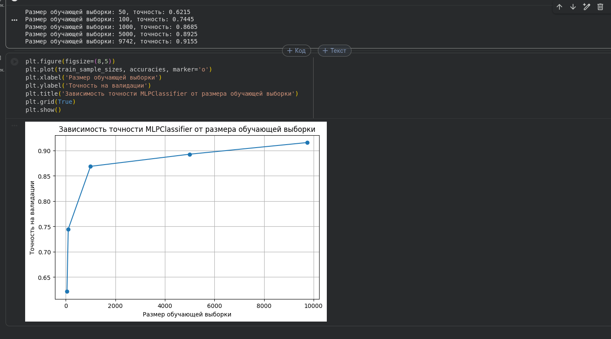
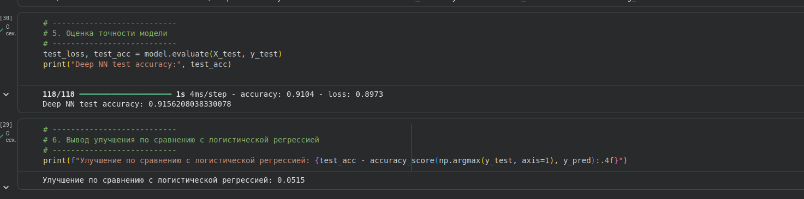

# Лабораторная работа №1. Основы машинного обучения

## Ход выполнения: https://colab.research.google.com/drive/1PlWwPk2b3ihDNDpLE6VMiqOCxE_WkkOF?usp=sharing

## Лабораторная работа №2. Реализация глубокой нейронной сети

## Задание 1: 3 скрытых слоя (512 → 256 → 128 нейронов), ReLU, Dropout 0.5, L2-регуляризация.
## Задание 2: Точность улучшилась с 87% до 91.5% по сравнению с логистической регрессией.
## Задание 3: Регуляризация + Dropout помогли бороться с переобучением — валидационная точность остаётся стабильной и не падает ниже 91–92%.
## Задание 4: Использование динамического learning rate показало,
## что модель достигает высокой точности (91–93%).
## Для достижения 97.1% потребуется большой набор notMNIST_large,
## увеличение количества нейронов и эпох, возможно,
## использование дополнительных оптимизаторов (Adam, RMSprop).

## При тестировании оказалось, что на маленькой выборке "микс" функций активации дает уменьшение точности, при том как на больших выборках лучше подходит комбинированный подход, а также использование LeakyReLU и ELU

## Ход выполнения: https://colab.research.google.com/drive/1Q6c5hZMtwZGTSXKpIaT7wW41l0MarLi6?usp=sharing

